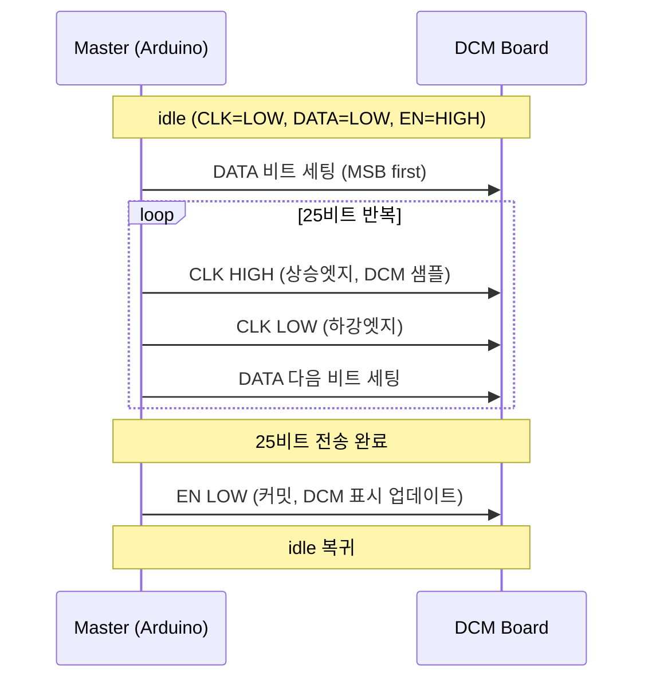

# Sigma OTIS DCM Elevator Hall Indicator Reverse Engineering

Sigma / LG-Otis **DCM-102N** 계열 엘리베이터 홀 인디케이터 보드 리버싱 연구 정리 노트 / 아두이노 예제

>  본 문서는 리버싱 결과를 정리한 것일 뿐이며 일부 항목들은 아직 분석 중입니다.

---

## 하드웨어


- 테스트에 사용된 모델은 DCM-102N, AEG11C702*A 세로형
- 가로형 모델도 핀맵 등이 같은것으로 보아 호환될것으로 추측됨
- DCM-102, AEG00C767*A 모델도 정상동작 확인 (수도권님 감사합니다.)
- DCM-116N COP도 정상동작 확인

### 식별 가능한 IC들

| IC | 역할(추정) |
|----|------|
| Atmel AT89S52 | 메인 MCU |
| MC34063A | DC-DC 컨버터? (24V → 5V) |
| 74HC14D | 슈미트 트리거 인버터 |
| LM339 | 비교기 |
| KID65003 × 3 | 달링턴 트랜지스터 어레이 |

### 커넥터 핀맵

#### 5핀 계열
| 핀 | 신호 | 설명 |
|----|------|------|
| 1 | DC24V | 전원 입력 |
| 2 | GND | 공통 그라운드 |
| 3 | DATA | 직렬 데이터 |
| 4 | CLK | 데이터 클럭 | 
| 5 | ENABLE | 프레임 커밋 (active low) |

#### 6핀 계열
| 핀 | 신호 | 설명 |
|----|------|------|
| 1 | DC24V | 전원 입력 |
| 2 | GND | 공통 그라운드 |
| 3 | GND | 공통 그라운드 |
| 4 | DATA | 직렬 데이터 |
| 5 | CLK | 데이터 클럭 | 
| 6 | ENABLE | 프레임 커밋 (active low) |
 
### 디스플레이 구조

| 자리 | 위치 |
|------|------|
|화살표| 상단 |
| 왼쪽 자리 | 10의 자리 |
| 오른쪽 자리 | 1의 자리 |
|점검중 램프 | 하단 1 |
|만원 램프 | 하단 2 |
---

## 전기적 특성

- **전원**: 24V
- **소비전력** : 약 0.1A (점검중, 만원, 도트매트릭스 애니메이션 전부 켰을때)
- **신호 방식**: 오픈컬렉터 + 24V 풀업
  - idle: 내부 풀업에 의해 22~24V (HIGH)
  - assert: GND로 당김 (LOW)

### 아두이노와 연결시

아두이노 핀을 DCM 보드의 신호 핀에 직결하는걸로 작동하였음 (레벨시프터 불필요).

```
assert   (LOW)  → pinMode(OUTPUT) + digitalWrite(LOW)
deassert (HIGH) → pinMode(INPUT)   //풀업이 24V로 올림
```

---

## 프레임 포맷 (불확실)

### 구조

총 25비트. 바이트 경계는 없어보임.

| 필드 | 비트 수 | 내용 |
|------|---------|------|
| LAMP | 6 | 화살표 방향, 화살표 애니메이션, 애니메이션 속도 , 점검중, 만원 |
|LEFT | 11 | 왼쪽 자리 문자/숫자 |
| RIGHT | 8 | 오른쪽 자리 문자/숫자 |

### 전송 파라미터

| 항목 | 값 |
|------|-----|
| 비트 순서 | MSB first |
| CPOL | 0 (CLK idle = LOW) |
| CPHA | 0 (DATA setup -> CLK 상승엣지 샘플) |
| EN 동작 | active-low, 25비트 전송 후 1회 커밋 |

---

## 통신 타이밍


## 실제 데이터 캡처


### 테스트된 타이밍

| 파라미터 | 값 | 비고 |
|----------|--------|------|
| CLK half-period | 50 µs | ~500Hz |
| EN 펄스폭 | 50 µs | 최솟값 미확인 |
| 프레임간 간격 |20ms 이상 | 권장값 |

---

## 문자 코드 테이블 (불확실)

### 숫자

| 문자 | 코드 |
|------|------|
| 0 | `0x3F` |
| 1 | `0x30`, `0x06` |
| 2 | `0xDB` |
| 3 | `0xCF` |
| 4 | `0xE6` |
| 5 | `0xED` |
| 6 | `0xFD` |
| 7 | `0x27` |
| 8 | `0xFF` |
| 9 | `0xEF` |

### 알파벳

| 문자 | 코드 | 문자 | 코드 | 문자 | 코드 |
|------|------|------|------|------|------|
| A | `0xF7` | B | `0x49` ⚠️ | C | `0x39` |
| D | `0x89` | E | `0xF9` | F | `0xF1` |
| G | `0xBD` | H | `0xF6` | I | `0x01` |
| J | `0x1E` | K | `0x05` | L | `0x38` |
| N | `0x09` | O | `0x11` | P | `0xF3` |
| Q | `0x21` | R | `0xB7` | S | `0x41` |
| T | `0x81` | U | `0x3E` | V | `0x0F` |
| W | `0x13` | X | `0x0A` | Y | `0x12` |
| Z | `0x22` | | | | |
| a | `0xDF` | b | `0xFC` | c | `0xD8` |
| d | `0xDE` | e | `0xBB` | f | `0x71` |
| g | `0x0C` | h | `0xF4` | i | `0x14` |
| j | `0x24` | k | `0x44` | m | `0x84` |
| n | `0x0D` | o | `0xDC` ⚠️ | p | `0x28` |
| q | `0x48` | r | `0xD0` | s | `0x50` |
| t | `0x90` | u | `0x1C` | v | `0xA0` |
| x | `0xA4` | y | `0x64` | z | `0x2C` |

> ⚠️ `B (0x49)`: 오른쪽 도트 매트릭스만 반응 (왼쪽 안됨)
> ⚠️ `o (0xDC)`: 도트 매트릭스 특성상 정확한 문자를 모르겠음

- 구형 세그먼트(사진) 비트들에 대응하는 문자를 표시하는걸로 보여짐
- 세그먼트 비트가 유효하지 않은 조합일 경우 해당 데이터는 무시됨 (반응 안함)

### 특수

| 코드 | 표시 |
|------|------|
| `0x00` | 소등 |
| `0xA5` | 오른쪽 가운데 점 |
| `0x25` | 아래쪽 가운데 점 |
| `0x45` | 도트 4개 회전 애니메이션 |

---

## 램프 비트맵

> 총 6비트 필드

| 비트 | 동작 |
|----|------|
| 0 | Up 화살표 |
| 1 | Down 화살표 |
| 2 | 만원 램프 |
| 3 | 점검중 램프 |
| 4 | 화살표 애니메이션 |
| 5 | 고속 화살표 애니메이션 |


- Up,Down 화살표 비트가 동시에 true일시 화살표는 소등됨 
- 고속 화살표 에니메이션은 true일시 비활성화됨. false일 경우 고속 활성화

---

## 아두이노 구현 예제


### 배선

#### Arduino
|핀 | 접속대상 |
|---|-------|
| D2 | DCM Pin 3 (DATA) |
| D3 | DCM Pin 4 (CLK) |
| D4 | DCM Pin 5 (ENABLE) |
| GND | 외부 24V 전원 GND |

#### DCM-102N
|핀 | 접속대상 |
|---|-------|
| 1 | 외부 24V 전원 + |
| 2 | 외부 24V 전원 GND |
| 3 | Arduino D2 |
| 4 | Arduino D3 |
| 5 | Arduino D4 |

### 사용 예시

```cpp
#include "DCMIndicator.h"

#define PIN_DATA 2
#define PIN_CLK 3
#define PIN_EN 4

DCMIndicator dcm(PIN_DATA, PIN_CLK, PIN_EN);

void setup(){
  dcm.begin(); //초기화
  dcm.clear(); //비우기
  dcm.setFloor(1); //도트에 1 설정
  delay(2000);

  dcm.setArrowUp(); //Up 화살표 표시
}

void loop(){

}
```

### 데모
[](http://www.youtube.com/watch?v=G_TavM1EVMw "video")
- 해당 영상에 사용된 데모 예제코드는 DCMIndicatorTest.ino 참조
---

## TODO

- [ ] 세그먼트 레이아웃 매핑 확정하기
---
## 기타
- 정정/코드 등 풀 리퀘스트는 언제나 환영합니다. 
---
